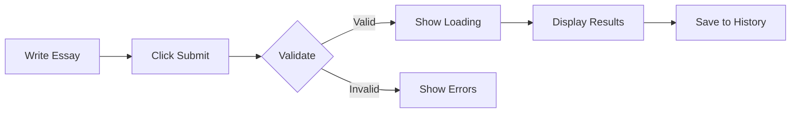

# PTE Essay Checker - Project Documentation

## Table of Contents
1. [Project Overview](#project-overview)
2. [Business Objectives](#business-objectives)
3. [Technical Architecture](#technical-architecture)
4. [Frontend Design](#frontend-design)
5. [Backend Architecture](#backend-architecture)
6. [AI Integration Strategy](#ai-integration-strategy)
7. [Data Models](#data-models)
8. [API Design](#api-design)
9. [Security & Compliance](#security--compliance)
10. [Implementation Roadmap](#implementation-roadmap)
11. [Cost Analysis](#cost-analysis)
12. [Scaling Strategy](#scaling-strategy)
13. [Monitoring & Analytics](#monitoring--analytics)
14. [Future Enhancements](#future-enhancements)

---

## Project Overview

### What is PTE Essay Checker?
An AI-powered web application that provides instant, accurate scoring and feedback for PTE Academic writing tasks. Users can submit their essays and receive comprehensive analysis based on official PTE scoring criteria.

### Key Features
- **Instant Essay Analysis**: Real-time scoring with detailed feedback
- **PTE-Aligned Scoring**: Follows official PTE Academic scoring guidelines
- **Comprehensive Feedback**: Grammar, vocabulary, coherence, and content analysis
- **Progress Tracking**: Historical performance analytics
- **Practice Topics**: Curated PTE essay topics with sample responses
- **Mobile Responsive**: Full functionality across all devices

### Target Users
- PTE Academic test takers
- English language learners
- Test preparation centers
- Individual tutors and coaches

---

## Business Objectives

### Primary Goals
1. **Accessibility**: Provide affordable PTE essay checking to global users
2. **Accuracy**: Achieve 90%+ correlation with official PTE scores
3. **Speed**: Deliver results within 10 seconds
4. **Scale**: Support 10,000+ daily active users by Year 1

### Revenue Model
```
Freemium Structure:
├── Free Tier: 3 essays/month
├── Basic: $9.99/month (50 essays)
├── Pro: $24.99/month (unlimited + advanced analytics)
└── Enterprise: Custom pricing for institutions
```

### Success Metrics
- User retention rate > 60%
- Average session duration > 15 minutes
- NPS score > 50
- Monthly recurring revenue growth > 20%

---

## Technical Architecture

### High-Level Architecture
```
┌─────────────────────────────────────────────────────────────────┐
│                         CloudFront CDN                           │
└─────────────────────────┬───────────────────────────────────────┘
                          │
┌─────────────────────────▼───────────────────────────────────────┐
│                    Amplify Hosting (Frontend)                    │
│                  Next.js 14 + React + TypeScript                 │
└─────────────────────────┬───────────────────────────────────────┘
                          │
┌─────────────────────────▼───────────────────────────────────────┐
│                      AWS AppSync (GraphQL)                       │
│              Authentication + Authorization + API                │
└────────┬──────────────────┬──────────────────┬─────────────────┘
         │                  │                  │
┌────────▼────────┐ ┌───────▼────────┐ ┌──────▼──────────────────┐
│ Lambda Functions│ │ DynamoDB Tables│ │  S3 Buckets             │
│ (Business Logic)│ │ (Data Storage) │ │ (Essays & Analytics)    │
└────────┬────────┘ └────────────────┘ └─────────────────────────┘
         │
┌────────▼────────────────────────────────────────────────────────┐
│                    AI Services Layer                             │
│          AWS Bedrock (Claude 3) + OpenAI GPT-4                  │
└─────────────────────────────────────────────────────────────────┘
```

### Tech Stack Details

#### Frontend
- **Framework**: Next.js 14 (App Router)
- **UI Library**: React 18 with TypeScript
- **Styling**: Tailwind CSS + Shadcn/ui components
- **State Management**: Zustand + React Query
- **Form Handling**: React Hook Form + Zod validation
- **Rich Text Editor**: Lexical or TipTap
- **Analytics**: Mixpanel + Vercel Analytics

#### Backend
- **Infrastructure**: AWS Amplify Gen 2
- **API**: GraphQL via AWS AppSync
- **Compute**: Lambda functions (Node.js 20.x)
- **Database**: DynamoDB (primary) + S3 (essay storage)
- **Authentication**: AWS Cognito
- **Caching**: ElastiCache for Redis
- **Queue**: SQS for async processing

#### AI Integration
- **Primary**: AWS Bedrock (Claude 3 Sonnet)
- **Fallback**: OpenAI GPT-4
- **Fine-tuning**: Custom model on SageMaker
- **Embedding**: OpenAI text-embedding-3

---

## Frontend Design

### Component Architecture
```
src/
├── app/                    # Next.js 14 app directory
│   ├── (auth)/            # Auth-required routes
│   │   ├── dashboard/
│   │   ├── essay/new/
│   │   └── history/
│   ├── (public)/          # Public routes
│   │   ├── page.tsx       # Landing page
│   │   ├── pricing/
│   │   └── about/
│   └── api/               # API routes
├── components/
│   ├── ui/                # Reusable UI components
│   ├── essay/
│   │   ├── Editor.tsx
│   │   ├── Timer.tsx
│   │   └── WordCounter.tsx
│   └── results/
│       ├── ScoreCard.tsx
│       ├── Feedback.tsx
│       └── Suggestions.tsx
├── lib/
│   ├── amplify/          # Amplify config
│   ├── graphql/          # Generated GraphQL
│   └── utils/
└── hooks/                # Custom React hooks
```

### Key User Flows

#### Essay Submission Flow


### Design System
- **Colors**: Blue primary (#0066CC), Success green (#00AA55)
- **Typography**: Inter for UI, Lora for essays
- **Spacing**: 8px grid system
- **Breakpoints**: Mobile (640px), Tablet (768px), Desktop (1024px)

---

## Backend Architecture

### Amplify Gen 2 Configuration

```typescript
// amplify/backend.ts
import { defineBackend } from '@aws-amplify/backend';
import { auth } from './auth/resource';
import { data } from './data/resource';
import { storage } from './storage/resource';
import { essayChecker } from './functions/essay-checker/resource';

export const backend = defineBackend({
  auth,
  data,
  storage,
  essayChecker,
});

// Custom business logic
backend.essayChecker.resources.lambda.addEnvironment({
  BEDROCK_MODEL_ID: 'anthropic.claude-3-sonnet',
  OPENAI_API_KEY: process.env.OPENAI_API_KEY,
});
```

### GraphQL Schema

```graphql
# amplify/data/schema.graphql
type Essay @model @auth(rules: [{ allow: owner }]) {
  id: ID!
  topic: String!
  content: String! @default(value: "")
  wordCount: Int!
  submittedAt: AWSDateTime!
  result: EssayResult @hasOne
  userId: String! @index(name: "byUser")
}

type EssayResult @model @auth(rules: [{ allow: owner }]) {
  id: ID!
  essayId: ID! @index(name: "byEssay")
  overallScore: Float!
  contentScore: Float!
  grammarScore: Float!
  vocabularyScore: Float!
  coherenceScore: Float!
  feedback: AWSJSON!
  processedAt: AWSDateTime!
}

type Subscription {
  onEssayProcessed(userId: String!): EssayResult
    @aws_subscribe(mutations: ["createEssayResult"])
}
```

### Lambda Functions

#### Essay Processing Function
```typescript
// amplify/backend/functions/essay-checker/handler.ts
import { BedrockRuntimeClient } from "@aws-sdk/client-bedrock-runtime";
import { DynamoDBClient } from "@aws-sdk/client-dynamodb";

export const handler = async (event: AppSyncResolverEvent) => {
  const { essay, topic } = event.arguments;
  
  // Initialize AI client
  const bedrock = new BedrockRuntimeClient({ region: 'us-east-1' });
  
  // Prepare prompt
  const prompt = generatePTEPrompt(essay, topic);
  
  // Get AI analysis
  const response = await bedrock.send(new InvokeModelCommand({
    modelId: 'anthropic.claude-3-sonnet',
    body: JSON.stringify({ prompt, max_tokens: 2000 })
  }));
  
  // Parse and structure results
  const analysis = parseAIResponse(response);
  
  // Calculate PTE-aligned scores
  const scores = calculatePTEScores(analysis);
  
  // Save to DynamoDB
  await saveResults(essay.id, scores, analysis);
  
  return scores;
};
```

---

## AI Integration Strategy

### Prompt Engineering

```typescript
const PTE_ESSAY_PROMPT = `
You are an expert PTE Academic examiner. Analyze this essay based on official PTE scoring criteria.

Topic: {topic}
Essay: {essay}

Provide scores (0-90) and detailed feedback for:
1. Content (relevance, development, examples)
2. Grammar (accuracy, complexity, range)
3. Vocabulary (range, precision, appropriateness)
4. Coherence (organization, linking, flow)
5. Spelling and Mechanics

Response format:
{
  "scores": {
    "content": 0-90,
    "grammar": 0-90,
    "vocabulary": 0-90,
    "coherence": 0-90,
    "mechanics": 0-90
  },
  "feedback": {
    "strengths": [],
    "improvements": [],
    "specific_errors": []
  }
}
`;
```

### AI Model Selection
1. **Primary**: Claude 3 Sonnet via Bedrock
   - Best for nuanced language understanding
   - Consistent scoring alignment
   
2. **Fallback**: GPT-4 via OpenAI
   - When Bedrock is unavailable
   - Cross-validation of scores

3. **Future**: Fine-tuned model
   - Train on 10,000+ scored PTE essays
   - Deploy on SageMaker endpoint

---

## Data Models

### DynamoDB Tables

#### Users Table
```json
{
  "PK": "USER#userId",
  "SK": "PROFILE",
  "email": "user@example.com",
  "subscription": "pro",
  "createdAt": "2024-01-15T10:00:00Z",
  "essayCount": 145,
  "averageScore": 78.5
}
```

#### Essays Table
```json
{
  "PK": "USER#userId",
  "SK": "ESSAY#timestamp",
  "essayId": "uuid",
  "topic": "Technology in education",
  "content": "Essay text...",
  "wordCount": 245,
  "status": "processed",
  "scores": {
    "overall": 82,
    "content": 85,
    "grammar": 80,
    "vocabulary": 83,
    "coherence": 81
  }
}
```

### S3 Bucket Structure
```
pte-essay-storage/
├── essays/
│   └── {userId}/
│       └── {essayId}.json
├── analytics/
│   └── daily/
│       └── {date}.json
└── exports/
    └── {userId}/
        └── progress-report.pdf
```

---

## API Design

### GraphQL Operations

#### Mutations
```graphql
mutation SubmitEssay($input: SubmitEssayInput!) {
  submitEssay(input: $input) {
    id
    status
    estimatedTime
  }
}

mutation SaveDraft($input: SaveDraftInput!) {
  saveDraft(input: $input) {
    id
    lastSaved
  }
}
```

#### Queries
```graphql
query GetEssayHistory($userId: ID!, $limit: Int) {
  getEssayHistory(userId: $userId, limit: $limit) {
    items {
      id
      topic
      overallScore
      submittedAt
    }
    nextToken
  }
}

query GetDetailedFeedback($essayId: ID!) {
  getEssayResult(id: $essayId) {
    scores
    feedback
    suggestions
  }
}
```

#### Subscriptions
```graphql
subscription OnEssayProcessed($userId: ID!) {
  onEssayProcessed(userId: $userId) {
    essayId
    overallScore
    feedback
  }
}
```

---

## Security & Compliance

### Authentication & Authorization
- **Multi-factor Authentication**: Via Cognito MFA
- **OAuth Integration**: Google, Microsoft, Facebook
- **Role-based Access**: Student, Teacher, Admin roles
- **API Rate Limiting**: 100 requests/minute per user

### Data Security
```typescript
// Encryption at rest
backend.data.resources.tables["Essay"].encryption = {
  type: TableEncryption.AWS_MANAGED
};

// Field-level encryption for sensitive data
const encryptField = (value: string): string => {
  return AWS.KMS.encrypt({
    KeyId: process.env.KMS_KEY_ID,
    Plaintext: value
  });
};
```

### Compliance
- **GDPR**: Data deletion, export capabilities
- **COPPA**: Age verification for users under 13
- **SOC 2**: Annual security audits
- **PCI DSS**: For payment processing

---

## Implementation Roadmap

### Phase 1: MVP (Weeks 1-4)
- [x] Project setup with Amplify Gen 2
- [x] Basic authentication with Cognito
- [x] Essay submission interface
- [x] AI integration (Bedrock)
- [x] Simple scoring display
- [ ] Basic user dashboard

### Phase 2: Core Features (Weeks 5-8)
- [ ] Advanced editor with word count
- [ ] Detailed feedback display
- [ ] Essay history with filters
- [ ] Progress tracking charts
- [ ] Email notifications
- [ ] Payment integration

### Phase 3: Enhancement (Weeks 9-12)
- [ ] Mobile app (React Native)
- [ ] Practice topics database
- [ ] Peer review feature
- [ ] Export to PDF
- [ ] Batch processing
- [ ] Teacher dashboard

### Phase 4: Scale (Months 4-6)
- [ ] Multi-region deployment
- [ ] Advanced analytics
- [ ] A/B testing framework
- [ ] Custom AI model training
- [ ] API for partners
- [ ] White-label options

---

## Cost Analysis

### Monthly Cost Breakdown (1000 users)

| Service | Usage | Cost |
|---------|-------|------|
| Amplify Hosting | 100GB transfer | $15 |
| AppSync | 1M requests | $4 |
| Lambda | 500K invocations | $10 |
| DynamoDB | 1GB + 1M requests | $25 |
| S3 | 50GB storage | $2 |
| Cognito | 1000 MAU | $0 |
| Bedrock | 100K tokens/day | $150 |
| CloudFront | 500GB transfer | $40 |
| **Total** | | **$246** |

### Cost Optimization Strategies
1. **Caching**: Redis for repeated essays
2. **Batch Processing**: Group AI requests
3. **Compression**: Gzip for essay storage
4. **Reserved Capacity**: For predictable workloads
5. **Spot Instances**: For training jobs

---

## Scaling Strategy

### Performance Targets
- **Response Time**: < 2s for UI, < 10s for AI
- **Availability**: 99.9% uptime
- **Throughput**: 1000 concurrent users
- **Storage**: Automatic scaling with DynamoDB

### Scaling Tactics

#### Horizontal Scaling
```typescript
// Lambda concurrency configuration
backend.essayChecker.resources.lambda.reservedConcurrentExecutions = 100;

// DynamoDB auto-scaling
table.autoScaleReadCapacity({
  minCapacity: 5,
  maxCapacity: 1000,
}).scaleOnUtilization({ targetUtilizationPercent: 70 });
```

#### Caching Strategy
```typescript
// Redis caching for common essays
const getCachedResult = async (essayHash: string) => {
  const cached = await redis.get(`essay:${essayHash}`);
  if (cached) {
    metrics.increment('cache.hit');
    return JSON.parse(cached);
  }
  return null;
};
```

---

## Monitoring & Analytics

### Technical Monitoring
- **AWS CloudWatch**: Lambda metrics, API latency
- **X-Ray**: Distributed tracing
- **Sentry**: Error tracking
- **Datadog**: Custom metrics

### Business Analytics
```typescript
// Mixpanel event tracking
export const trackEvent = (event: string, properties: any) => {
  mixpanel.track(event, {
    ...properties,
    timestamp: new Date().toISOString(),
    sessionId: getSessionId(),
    userId: getUserId()
  });
};

// Key events to track
trackEvent('essay_submitted', { wordCount, topic });
trackEvent('feedback_viewed', { score, timeSpent });
trackEvent('subscription_upgraded', { plan, revenue });
```

### Dashboard KPIs
- Daily active users
- Average session duration
- Essay submission rate
- Score distribution
- User retention cohorts
- Revenue per user

---

## Future Enhancements

### Year 1 Roadmap
1. **Speaking Module**: AI-powered pronunciation analysis
2. **Reading Module**: Comprehension testing
3. **Listening Module**: Audio transcription exercises
4. **Full Mock Tests**: Complete PTE simulation

### Advanced Features
- **AI Writing Assistant**: Real-time suggestions
- **Plagiarism Detection**: Academic integrity
- **Multi-language Support**: 10+ languages
- **Peer Learning**: Community features
- **Gamification**: Badges, streaks, leaderboards

### Technical Innovations
- **Edge Computing**: CloudFront Functions for faster responses
- **WebAssembly**: Client-side grammar checking
- **Federated Learning**: Privacy-preserving AI
- **Blockchain**: Verifiable certificates

---

## Conclusion

The PTE Essay Checker represents a significant opportunity to democratize English language test preparation. By leveraging AWS Amplify Gen 2's fullstack capabilities with advanced AI integration, we can deliver a product that's not just technically sound but genuinely helpful to millions of test-takers worldwide.

### Next Steps
1. Finalize technical requirements
2. Set up development environment
3. Begin Phase 1 implementation
4. Recruit beta testers
5. Establish feedback loops

### Contact
**Project Lead**: StackTrace (Leona Voss)  
**Technical Queries**: stacktrace@ptechecker.ai  
**Business Inquiries**: business@ptechecker.ai

---

*"Declare, deploy, iterate. Let's build something that matters."* - StackTrace